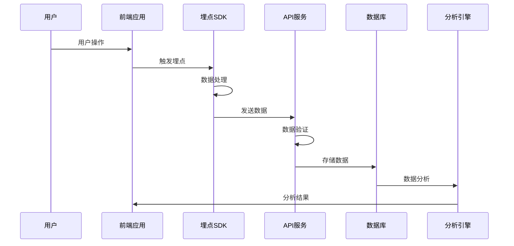

# 介绍

埋点监控系统是一个完整的前端数据收集和分析解决方案，旨在帮助开发者轻松实现用户行为追踪、错误监控和性能分析。

## 什么是埋点监控？

埋点监控是一种数据收集技术，通过在应用程序中插入特定的代码（埋点），来收集用户的行为数据、系统性能数据和错误信息。这些数据对于产品优化、用户体验改善和问题排查都非常重要。

## 系统特性

### 🎯 全面的数据收集

- **用户行为追踪**: 记录用户的点击、浏览、滚动等操作
- **页面性能监控**: 收集页面加载时间、资源加载状态等性能指标
- **错误异常捕获**: 自动捕获 JavaScript 错误、Promise 拒绝等异常
- **自定义事件**: 支持业务相关的自定义埋点事件

### 🚀 多种上报方式

系统支持四种不同的数据上报方式，适应不同的使用场景：

| 上报方式 | 特点 | 适用场景 |
|---------|------|---------|
| **Fetch** | 现代浏览器标准，支持 Promise | 现代 Web 应用 |
| **XHR** | 传统 XMLHttpRequest，兼容性好 | 需要兼容老浏览器 |
| **JSONP** | 跨域友好，无需 CORS 配置 | 跨域数据上报 |
| **Image** | 最轻量级，几乎无兼容性问题 | 简单埋点、离开页面时上报 |

### 🛡️ 智能错误监控

- **自动错误捕获**: 监听全局错误事件，自动收集异常信息
- **详细错误信息**: 包含错误堆栈、文件位置、用户环境等详细信息
- **错误分类管理**: 支持错误级别分类和解决状态跟踪
- **实时错误告警**: 可配置错误阈值和告警机制

### 📊 会话管理

- **自动会话跟踪**: 智能识别用户会话，记录会话开始和结束时间
- **会话统计**: 统计页面浏览次数、事件数量、错误次数等
- **跳出率分析**: 计算会话跳出率，分析用户参与度
- **设备信息**: 自动解析用户设备、浏览器、操作系统等信息

## 技术架构

### 前端 SDK

- **轻量级设计**: 核心代码小于 50KB，不影响页面性能
- **TypeScript 支持**: 完整的类型定义，提供良好的开发体验
- **插件化架构**: 支持自定义插件扩展功能
- **异步处理**: 所有数据上报都是异步进行，不阻塞页面渲染

### 后端服务

- **Node.js + Express**: 高性能的后端 API 服务
- **MySQL 数据库**: 可靠的数据存储方案
- **RESTful API**: 标准的 REST 接口设计
- **数据验证**: 完整的数据验证和错误处理机制

### 数据存储

- **分表设计**: 埋点数据和错误日志分别存储，提高查询效率
- **索引优化**: 针对常用查询场景优化数据库索引
- **数据归档**: 支持历史数据归档和清理策略
- **扩展性**: 支持水平扩展和分库分表

## 应用场景

### 📈 产品分析

- **用户行为分析**: 了解用户如何使用产品功能
- **页面热力图**: 分析页面元素的点击分布
- **转化漏斗**: 追踪用户在关键流程中的转化情况
- **A/B 测试**: 支持不同版本的效果对比分析

### 🐛 问题排查

- **错误监控**: 快速发现和定位线上问题
- **性能监控**: 监控页面性能，识别性能瓶颈
- **用户反馈**: 结合用户操作路径分析问题原因
- **回放分析**: 通过埋点数据重现用户操作过程

### 🎯 业务优化

- **功能使用统计**: 了解哪些功能最受欢迎
- **用户画像**: 基于行为数据构建用户画像
- **个性化推荐**: 根据用户行为提供个性化内容
- **营销效果**: 评估营销活动的效果和ROI

## 数据流程

## 开始使用

准备好开始使用埋点监控系统了吗？查看我们的 [快速开始指南](./getting-started.md) 来开始你的第一个埋点项目。

如果你想了解更多技术细节，可以查看：

- [项目架构](./architecture.md) - 了解系统的整体设计
- [数据库设计](./database.md) - 查看数据存储结构
- [API 文档](../api/tracking.md) - 详细的接口说明
- [示例代码](../examples/basic.md) - 实际使用示例
