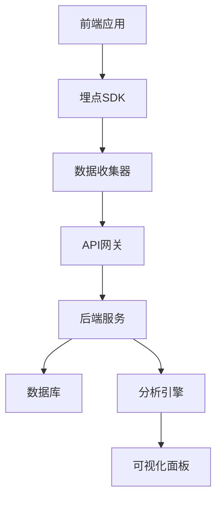

## 快速预览

### 🎯 简单集成

```javascript
import { TrackingSDK } from '@tracking-system/sdk'

// 初始化
const tracker = new TrackingSDK({
  endpoint: 'https://your-api.com/api/tracking/events',
  userId: 'user123',
  sessionId: 'session_xxx'
})

// 发送埋点
tracker.track('click', {
  spm: 'home.button.login',
  element: { tagName: 'button', text: '登录' }
})
```

### 🔄 智能错误捕获

```javascript
// 自动捕获 JavaScript 错误
window.addEventListener('error', (event) => {
  tracker.trackError({
    type: 'javascript_error',
    message: event.message,
    filename: event.filename,
    lineno: event.lineno,
    stack: event.error?.stack
  })
})
```

### 📊 数据查询

```javascript
// 查询埋点数据
fetch('/api/tracking/events?startDate=2024-01-01&endDate=2024-01-31')
  .then(res => res.json())
  .then(data => console.log('埋点数据:', data))
```

## 核心特性

### 🎯 多维度数据收集

- **用户行为追踪**: 点击、浏览、停留时间等
- **页面性能监控**: 加载时间、资源加载状态
- **错误异常监控**: JavaScript 错误、网络异常
- **自定义事件**: 业务相关的特定事件

### 🚀 高性能设计

- **异步上报**: 不阻塞页面主线程
- **批量发送**: 减少网络请求次数
- **智能重试**: 网络异常时自动重试
- **数据压缩**: 最小化传输数据量

### 🛡️ 数据安全

- **数据加密**: 支持 HTTPS 传输
- **访问控制**: API 接口权限管理
- **数据脱敏**: 敏感信息自动处理
- **合规支持**: 符合数据保护法规

## 技术架构



## 开始使用

1. **安装依赖**
   ```bash
   npm install @tracking-system/sdk
   ```

2. **初始化配置**
   ```javascript
   import { TrackingSDK } from '@tracking-system/sdk'
   
   const tracker = new TrackingSDK({
     endpoint: 'your-api-endpoint',
     appVersion: '1.0.0'
   })
   ```

3. **发送埋点数据**
   ```javascript
   tracker.track('page_view', {
     page: { title: '首页', url: location.href }
   })
   ```

---

<div class="tip custom-block" style="padding-top: 8px">

想要了解更多？查看我们的 [快速开始指南](./guide/getting-started.md) 或者浏览 [API 文档](./api/tracking.md)。

</div>
